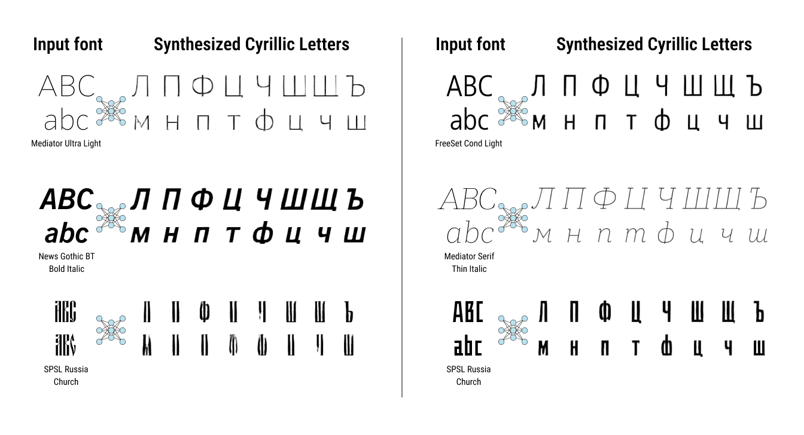

# DeepVecFont Cyrillic

This is the Pytorch implementation of the paper "[Yizhi Wang and Zhouhui Lian. DeepVecFont: Synthesizing High-quality Vector Fonts via Dual-modality Learning. SIGGRAPH Asia. 2021.](https://arxiv.org/abs/2110.06688)" for Cyrillic letters.

	 

## Cyrillic Updates
### 2023-02-11

- This DeepVecFont modification generates Cyrillic letters with Latin fonts in input.
- Font transformation from TTF/OTF to SFD includes both Latin and Cyrillic lettes.
- Both Main Model and Neural Rasterizer are modified for Cyrillic letters and retrained.
- Rasterizer was trained on `700 epochs` with `batch size = 12` and `learning rate = 0.0001`. Main Model was trained on `150 epochs`, with `batch size = 12` and `learning rate = 0.0002`.

## Future Improvements

- Experiment with Main Model:
	- increasing epoch number;
	- increasing batch size and modifying zero grad in training loop for less powerful GPU;
	- lowering learning rate.
- Considering glyphs with longer sequences (currentlly used `max length = 251` is too low for cyrillic leters `ж` in most fonts)
- Increasing viewport of letters. Currently used viewport crops wide symbols.

## Acknowledgment

- [DeepVecFont](https://yizhiwang96.github.io/deepvecfont_homepage/)
- [SVG-VAE](https://github.com/magenta/magenta/tree/main/magenta/models/svg_vae)
- [SVG-VAE-pytorch](https://github.com/hologerry/svg_vae_pytorch) by [hologerry](https://github.com/hologerry)
- [Diffvg](https://github.com/BachiLi/diffvg)
- [Paratype](https://www.paratype.com/)